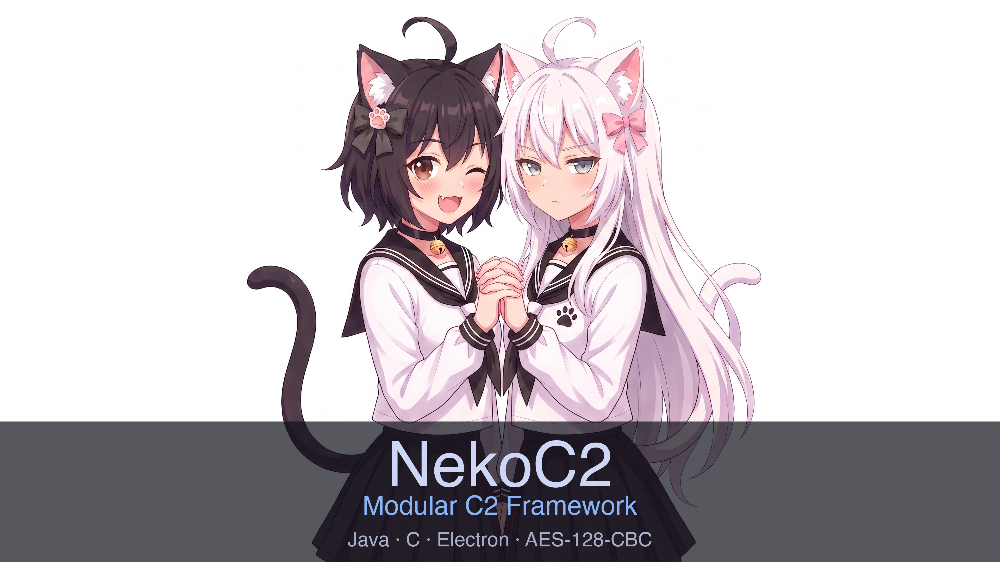

<p align="center">
  
</p>

<h1 align="center">NekoC2</h1>

<p align="center"><b>自研协议模块化 C2 框架</b></p>

<p align="center">Java · C · Electron · AES-128-CBC · Stageless</p>

---

## 架构

```
┌──────────────┐     WebSocket      ┌──────────────┐
│  KuroNeko    │◄──────────────────►│  ShiroNeko   │
│  (Operator)  │     Mgmt API       │  (TeamServer)│
└──────────────┘                    └──────┬───────┘
                                           │ 自研 C2 协议
                                           ▼
                                    ┌──────────────┐
                                    │  NekoAgent   │
                                    │  (C / Java)  │
                                    └──────────────┘
```

| 组件 | 语言 | 职责 |
|------|------|------|
| **ShiroNeko** | Java | TeamServer：agent 管理、任务下发、WebSocket 推送、listener 管理、中转文件存储 |
| **KuroNeko** | Electron (JS) | Operator Console：agent 列表、交互终端、文件管理器、截屏、payload 生成 |
| **NekoAgent** | C / Java | Agent：beacon 回连、命令执行、文件传输、截屏 |

## 功能

- **自研 C2 协议**：TeamServer ↔ Agent 通信协议自研，不复用常见 C2 框架的协议特征
- **命令执行**：exec / shell（异步不阻塞 beacon）、ps / kill
- **文件管理**：CS 风格文件管理器（左目录树 + 右文件列表）、上传 / 下载 / 删除 / 新建 / 重命名
- **截屏**：Windows GDI / Java Robot，自动存服务端中转存储
- **中转文件**：所有下载/截屏存服务端，前端暂存 tab 查看（图片/文本预览）
- **多 Operator**：共享密码 + 自定义 username，op 全链透传隔离（B 看不到 A 的结果）
- **Payload**：stageless patch 生成（C stub magic patch / Java jar zip patch）
- **加密**：per-request AES-128-CBC 动态密钥信封
- **跨平台**：Windows x64/x86（MinGW）、Linux x64/x86（musl 静态）、Java 8 jar

## 技术栈

| 组件 | 技术 |
|------|------|
| ShiroNeko | Java 8 · HttpServer · WebSocket · Maven |
| KuroNeko | Electron 33 · Vanilla JS · electron-builder |
| NekoAgent (C) | C99 · MinGW · musl · OpenSSL · WinHTTP · stb_image_write |
| NekoAgent (Java) | JDK 8 · javax.crypto · HttpURLConnection |
| CI | GitHub Actions · Docker (ubuntu + alpine) |

---

<p align="center"><i>仅供授权安全测试、红队评估和安全研究教育使用</i></p>
