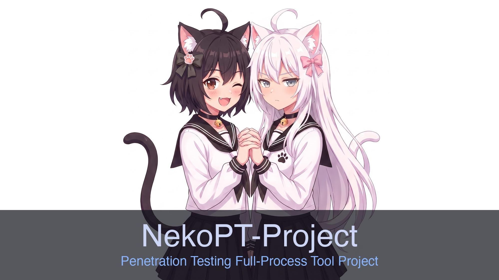

  

<b>NekoPT</b> — 面向授权渗透测试全流程的自研工具集

---

## 工具集

> 下列为当前已公开介绍的组件，工具链仍在持续扩充。

| 工具 | 定位 | 技术栈 |
|------|------|--------|
| **[NekoC2](../NekoC2/)** | 自研协议模块化 C2 框架（agent 管理、任务下发、交互终端、文件管理、截图） | Java · C · Rust · Electron |
| **[NekoGate](../NekoGate/)** | 自研协议内网穿透 + 五种流量伪装 | Rust · React · Ant Design |
| **[NekoVWrap](../NekoVWrap/)** | vshell 专用流量包装器（单文件投递 · 静默后台 · 出站伪装） | Go |
| **[NekoPriv](../NekoPriv/)** | Linux 本地安全测试终端工具（多内核提权模块，按 CVE 一键执行） | Go |
| **[NekoLoot](../NekoLoot/)** | 三平台本地敏感信息搜集（浏览器/凭据/IM/文件，模块化采集） | Rust |

---

## 特点

- **全流程自研**：目标覆盖渗透测试各阶段所需能力，不依赖「拼凑开源工具链」
- **自研协议与实现**：通信与核心逻辑自主设计，规避常见开源工具的已知特征与签名
- **模块化组合**：各工具可独立使用，也可按任务灵活串联
- **持续扩充**：围绕实战缺口补齐组件，公开介绍会随新工具同步更新

---

<i>本仓库仅作组织与项目介绍；工具本体不开源。仅供授权安全测试与研究使用。</i>

